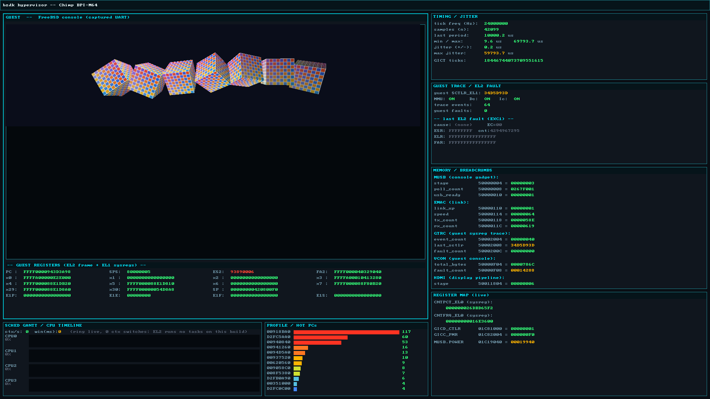

# lima-freebsd — the Mali-400 (lima) DRM driver stack, ported to FreeBSD/arm64

A working FreeBSD port of the Linux `lima` DRM driver for ARM Mali-400/450 GPUs,
plus the two pieces of FreeBSD infrastructure it turned out to need and that do
not exist anywhere else.

**It renders.** On an Allwinner A64 (Banana Pi M64), FreeBSD 15.1 arm64:

```
limabench: sampled texture + 2420 draw calls + depth testing + alpha blending
           512x512 with a depth buffer, 4/4 runs pass, zero GPU MMU faults
           glGetError clean
```

Mesa 26.2's `lima` gallium driver runs on top of it unmodified, giving EGL 1.5 +
OpenGL ES 2.0. A textured, depth-tested, perspective 3D scene renders at
~1030 fps at 1120×276 when presentation is unpaced, and 59.7 fps when every
frame waits on a display flip-completion event.

---



*Seven textured, depth-tested, alpha-blended cubes rendered by the Mali-400 on a
Banana Pi M64 running FreeBSD 15.1 — 2420 draw calls per frame, presented
zero-copy through DRM/KMS page flips paced by the real panel vblank. The frame
was captured from outside the guest, by the hypervisor, which is why the
instrumentation around it is visible: live timing/jitter, a PC-sample profiler
histogram, and the guest's own register state.*

## Why this exists

`lima` is upstream in Linux. Every render-only SoC GPU driver there is built on
`drm_gem_shmem_helper`, and every DT-probed driver is built on
`platform_device`. On FreeBSD:

- **drm-kmod ships no shmem GEM helper at all.** Not a stub — absent. Neither
  `include/drm/drm_gem_shmem_helper.h` nor the `.c` exists in any released tag,
  and its `drm/Makefile` never mentions shmem, so every `drm_gem_shmem_*` symbol
  resolves nowhere. `drm/drm_gem_shmem_helper.c` here is a real implementation
  against FreeBSD's VM: `OBJT_SWAP` backing store, `shmem_read_mapping_page()`
  for page acquisition, `pmap_page_set_memattr()` where Linux would use
  `set_pages_array_wc()`.
- **LinuxKPI's `platform_device` is a stub whose `platform_driver_register()`
  returns `-ENXIO`.** Literally `pr_debug("%s: TODO\n", __func__)`. That makes
  the probe routine of *any* Linux SoC/DT driver unreachable dead code, not just
  this one. `linux/platform_device.{c,h}` here is a genuine newbus/FDT ↔ LinuxKPI
  bridge: a simplebus child becomes a `struct platform_device`, resources and
  IRQs are translated, and registration happens at `module_init` time rather
  than via a file-scope `DRIVER_MODULE` — deliberately, because
  `SI_SUB_DRIVERS` would attach (and call `drm_dev_alloc()`) before `drm.ko`'s
  own `module_init` had run when both load in one `kldload`.

Neither of those is lima-specific. If you are porting any other Mali-less SoC
DRM driver to FreeBSD, they are probably what you need first.

---

## Layout

| path | what |
|---|---|
| `lima_*.c/h` | the driver, ported from Linux 6.6's `drivers/gpu/drm/lima` |
| `drm/drm_gem_shmem_helper.c` | shmem GEM helper, FreeBSD implementation (see above) |
| `drm/drm_gem_shmem_logic.h`, `tests/test_shmem_logic.c` | the refcount/state logic split out so it can be unit-tested on the host |
| `linux/platform_device.{c,h}` | newbus/FDT ↔ LinuxKPI platform_device bridge |
| `linux/{clk,reset,interrupt}.h`, `linux/regulator/consumer.h` | local shims for the LinuxKPI headers that are stubs |
| `patches/` | fixes required in FreeBSD, drm-kmod and ports — see below, and `patches/UPSTREAM-INDEX.md` |
| `docs/EXTRACTION.md` | what travels and what does not, and why — read this before reusing any of it |
| `tests/` | `limabench` (the real workload), `limatri` (one triangle), ioctl smoke tests, host-side unit tests |
| `mesa/` | notes on cross-building Mesa 26.2 with the lima gallium driver for FreeBSD/arm64 |

---

## Building

Cross-built on Linux, which is supported and is how it is developed:

```sh
MAKEOBJDIRPREFIX=/path/to/objdir bmake \
    -m /path/to/freebsd-src/share/mk \
    MACHINE=arm64 MACHINE_ARCH=aarch64 \
    SYSDIR=/path/to/freebsd-src/sys \
    DRM_KMOD_SRC=/path/to/drm-kmod \
    CC="clang --target=aarch64-unknown-freebsd15.1" LD=ld.lld \
    COMPILER_TYPE=clang COMPILER_VERSION=210100 \
    XARGS_J=-I OBJCOPY=llvm-objcopy NM=llvm-nm
```

Two non-obvious flags: `MACHINE`/`MACHINE_ARCH` rather than `TARGET` (which only
works inside the `buildkernel` wrapper), and `XARGS_J=-I` because `kmod.mk`'s
symbol step uses BSD-only `xargs -J`. drm-kmod is expected at tag
`drm_v6.6.25_13` with the patches below applied. The `Makefile`'s
`DRM_KMOD_SRC?=` default points at the author's layout — override it.

---

## Patches this needs, and why (`patches/`)

These are **bugs in other trees**, each diagnosed from a symptom on real
hardware. **Ten of them, across three trees** — FreeBSD base, drm-kmod, and the
ports tree. `patches/UPSTREAM-INDEX.md` is the full list with apply order, which
board depends on which, and where each write-up lives; four carry their
reasoning as a header inside the patch file rather than a separate document.

**One of them is not a porting fix and matters to people who have never heard of
this driver:** `patches/drm-kmod/drm-kmod-dri-sysctl-lifecycle.patch`. drm-kmod
puts the shared `hw.dri` sysctl node into a per-device context, so
`sysctl_ctx_free()` fails with EBUSY and removes nothing while cleanup frees the
struct those OIDs point into. An **unprivileged `sysctl -a` then panics the
kernel**, and GL breaks after any driver reload until reboot. No lima, no Mali
and no bzdOS needed to reproduce — any FreeBSD machine running a DRM driver
where debugfs is unavailable.

**FreeBSD** (`sys/compat/linuxkpi/common/src/linux_pci.c`, unless noted):

- `dma_alloc_coherent()` returned **cacheable** memory on arm64.
  `VM_MEMATTR_DEFAULT` is write-back there, so the one allocator whose contract
  is "no cache maintenance required" handed out cached memory and gave its
  physical address to a device. lima's GPU page tables live in that memory, so
  the Mali MMU read stale DRAM: **this was a black frame with no error
  anywhere.**
- `dma_map_sg()` could not map multi-page lists on non-coherent arm64.
  `nsegments = 1` bounds busdma's per-map sync list and `sync_count` accumulates
  across calls on one map, so entry 1 of a 64-entry list always failed `EFBIG`.
- `sgl->dma_map` left stale on every map-failure path (three distinct ways), so
  unmap dereferenced garbage — a `far = 0x1` panic.
- `aw_ccung`: transposed gate/lock arguments on A83T CPUX PLLs.
- `ccu_a64`: every fractional clock missing `AW_CLK_HAS_GATE`, which is why the
  GPU's power gate never opened. Audit of all affected clocks:
  `patches/freebsd-allwinner-clk-gate-audit.md`.

**drm-kmod** (tag `drm_v6.6.25_13`):

- `dma_buf_mmap()` did not exist, so no imported buffer could be mapped.
- A device-alias lifecycle bug.
- `drm_add_busid_modesetting()` assumes **every** DRM device is PCI:
  `to_pci_dev(dev->dev)` then `pdev->bus->number`, unconditionally, for every
  `drm_dev_register()`. Any platform/SoC DRM driver walks backwards off a struct
  that is not a `pci_dev`. This port survives it only because its parent happens
  to sit in readable heap memory and the bus id comes out silently garbage — a
  latent landmine, not a solution. The patch guards it with `dev_is_pci()`.

None of these have been submitted upstream yet — that needs the author's own
accounts, not more engineering. `patches/UPSTREAM-INDEX.md` exists so whoever
sends them does not have to re-derive anything.

---

## Status, honestly

**Works, measured on hardware:** GPU probe and reset, PMU, clocks and
regulators, the MMU including page-table setup and fault reporting, GP and PP
job submission, the tile-list heap (growable heap BOs), L2 cache maintenance,
GEM/PRIME import and export, and Mesa's lima driver on top. `limabench` passes
4/4 with textures, 2420 draws, depth and blending, zero MMU faults.

**Known open items** are enumerated with evidence in `docs/LOOSE-ENDS.md` (added
alongside this README). The three worth knowing before you build on it:

- `lima_vm.c` maps **every** BO `LIMA_VM_FLAGS_CACHE`; `LIMA_VM_FLAGS_UNCACHE`
  is defined and unused. For a buffer written by the PP and read by a display
  engine, uncached is probably right.
- `lima_l2_cache_flush()`'s return value is ignored by both call sites, exactly
  as upstream does — so an abandoned flush risks stale pixels silently. Note
  also that LinuxKPI's `ktime_get()` is the **coarse** `getnanouptime()`, which
  only advances on a tick: upstream's `1000 us` poll deadline is really one to
  two milliseconds on FreeBSD, and no sub-tick deadline expressed that way means
  anything. Raising it to 20 ms took observed timeouts from 41-in-six-hours
  to 0.
- The GPU-wedge teardown timeout path has never executed, because exercising it
  needs a deliberately wedged GPU.

**Not attempted:** Mali-450, anything with more than 2 PP cores than this board
has, and power management beyond what bring-up needed.

---

## Can you use this on your own board?

Today: **yes if you are willing to port, no if you want a package.** Being honest
about where the wall is saves you the afternoon it cost to find it.

What you must do now:

1. Clone this repo.
2. Get `freebsd-src` at `releng/15.1` and drm-kmod at tag `drm_v6.6.25_13`.
3. Apply the patches in `patches/freebsd-src/` and `patches/drm-kmod/` to those
   trees. The kernel ones are not optional: without the
   `dma_alloc_coherent` cache-attribute fix you get a black frame and no error
   message anywhere, and without the Allwinner clock fix the GPU's PLL cannot be
   enabled at all.
4. Build (recipe above) and `kldload lima`. `/dev/dri/card0` and
   `/dev/dri/renderD128` should appear; `tests/limatri` and `tests/limabench`
   will tell you whether the GPU is actually rasterising.
5. **Then hit the wall: userland.** FreeBSD's packaged Mesa cannot drive this
   GPU. `mesa-dri` ships 49 `*_dri.so`, but they are symlinks to one loader, and
   the `libgallium` behind it contains the string `lima: driver missing` — lima
   is in the loader's device table and simply not compiled in, where `panfrost`
   is. So you must hand-build Mesa with `-Dgallium-drivers=lima`, into a prefix
   that a later `pkg install` will not overwrite. Note `pkg lock` does not help:
   it locks an installed *package*, and a hand-built Mesa is not one.

   **There is now a patch for that wall too**:
   `patches/freebsd-ports/mesa-dri-lima-gallium-option.patch` adds a `lima`
   option to `graphics/mesa-dri`, following the `panfrost` pattern — three lines
   in the Makefile plus one `pkg-plist` entry, and deliberately no libclc/LLVM
   dependency, because lima's gpir/ppir compilers need neither. Until it is
   merged the hand-build above is still the only route.

Three things would turn that into something an ordinary FreeBSD user can
install, in rising order of effort:

- **Enable `lima` in the `graphics/mesa-dri` port** (`GALLIUM_DRIVERS`), so
  `pkg install mesa-dri` produces a userland that works. `panfrost` is already
  enabled there, so the precedent and the machinery both exist. This is the
  single highest-leverage change and it is not in this repo — it belongs in the
  FreeBSD ports tree.
- **Upstream the ten patches** (see `patches/UPSTREAM-INDEX.md`), so step 3 disappears.
- **Upstream the driver into drm-kmod**, so step 1 disappears too. The two
  infrastructure pieces here (`drm/drm_gem_shmem_helper.c` and
  `linux/platform_device.{c,h}`) are the parts drm-kmod would need regardless,
  and they are useful to every other SoC DRM driver anyone tries to port next —
  which is a better argument for taking them than lima itself.

If you only want to read something: `docs/LOOSE-ENDS.md` is the register of what is
still wrong, and the `patches/UPSTREAM-*.md` write-ups each trace one bug from
symptom to root cause on real hardware.

## Where this came from

Developed inside **bzdk** — a from-scratch bare-metal **EL2 hypervisor** for the
Banana Pi M64, running FreeBSD 15.1 arm64 as its guest. The GPU work happened
inside that guest, which is why some comments in this tree reference stage-2
faults, EL2, or a hypervisor-owned display. That context is kept rather than
scrubbed, because several bugs here are only explicable with it — a console write
being a synchronous stage-2 fault, for instance, changes what "add a printf"
costs.

Nothing in the code depends on that hypervisor. Every reference to it is a
comment; the driver builds and runs on bare-metal FreeBSD/arm64 with the patches
above. The parts that genuinely were hypervisor-specific — a scanout-import path
and a hypervisor-framebuffer shim — are deliberately **not** in this repository.
See `docs/EXTRACTION.md` for the exact boundary.

### The three projects, and which is which

The names are easy to confuse, so plainly:

- **bzdk** — <https://github.com/bzdOS/bzdk> — the EL2 hypervisor above.
  **This** is what the Mali work ran under, and it is where every "measured from
  outside the guest" number in this repository comes from: the screenshot at the
  top of this file was taken by it, while the guest was running.
- **bzdOS** — the operating system: a privacy-first FreeBSD-based OS for ARM64,
  with jailed apps, a Zenoh mesh and zero-copy Wayland streaming.
  <https://github.com/bzdOS/bsdos>. A different project from bzdk; this driver is
  what eventually gives it accelerated graphics on Allwinner hardware.
- **hubd** — <https://github.com/bzdOS/hubd> — the project tracker the work was
  run through: one backlog and journal in plain files, for teams of humans *and*
  AI agents, with an MCP server and a CLI.

What bzdk contributed to this port is worth naming, because it is why the bugs
below were findable at all: a debug plane on a dedicated core that outlives the
guest, breadcrumb windows readable post-mortem, and a screenshot path that reads
the framebuffer from outside the guest — including while the guest is wedged.
The image at the top of this file was taken that way.

What hubd contributed is less obvious and mattered as much: **the build machine
and the board were not the same machine.** The cross-compiler, the FreeBSD and
drm-kmod source trees and the Mesa build lived on one host; the Banana Pi arrived
at another, on a different network, with the serial console and the debug
Ethernet physically attached there. So the work was split across machines, and
several agents worked it in parallel — one bringing up clocks, another chasing
DMA coherency, another writing the tests. hubd is what kept that coherent: a
single task backlog and journal both machines wrote to, so "the board is busy",
"this patch is already applied to that tree" and "this claim was measured, here
is the number" were shared facts rather than things each agent rediscovered.
Every incident write-up referenced in this repository came out of that journal.
It costs nothing to run and needs no server.

---

## Licence

The ported files carry their upstream licences (`GPL-2.0 OR MIT` for the lima
sources and the shmem helper, as in Linux). The FreeBSD-specific
infrastructure — `linux/platform_device.{c,h}`, `linux/platform_logic.h`, the
local shims, and the tests — is original work under `BSD-2-Clause`, and copies
no Linux code. Per-file `SPDX-License-Identifier` tags are authoritative.
